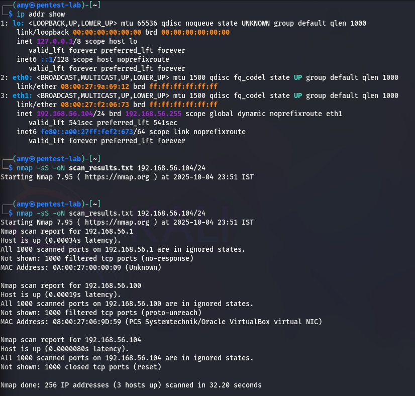
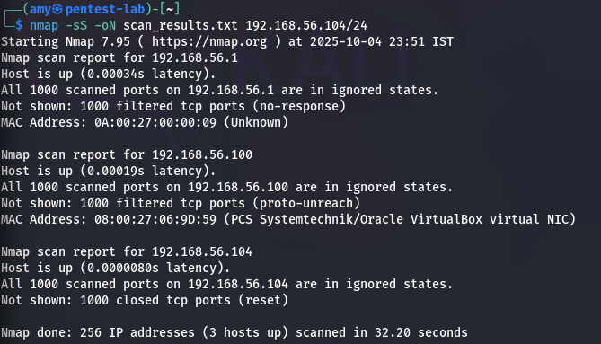

# Local Network Security Scan & Analysis: A Mini-Project

This repository documents a mini-project focused on network reconnaissance. The project involved using Nmap to scan a local network, analyze the results for open ports, and assess the overall security posture.

---

## Project Goal

The goal of this project was to explore and apply basic network reconnaissance skills. By discovering the state of ports on devices within my local network, I aimed to better understand the network's service exposure and potential security risks.

---

## Tools Used

* **Nmap**: The core tool used for performing the TCP SYN network port scan.

---

## Methodology

The project followed these steps:

1.  **Network Discovery**: First, I identified my local IP address and subnet mask to determine the target network range, which was `$192.168.56.0/24$`.

2.  **Scan Execution**: I executed the following Nmap command in the terminal to perform a TCP SYN scan (`-sS`) on the entire subnet and save the output (`-oN`) to a text file:
    ```bash
    nmap -sS -oN scan_results.txt 192.168.56.104/24
    ```

3.  **Analysis**: I then analyzed the output file, `scan_results.txt`, to identify active hosts and the state of their ports.

---

## Scan Results and Analysis

The scan identified 3 active hosts within the target range. The most significant finding was that **no open TCP ports were found** on any of the active devices. This indicates a strong security posture with a minimal attack surface.

The detailed results for each host are below:

| IP Address      | MAC Address           | Host Status | Port Status          | Analysis                                                                                                                             |
| :-------------- | :-------------------- | :---------- | :------------------- | :----------------------------------------------------------------------------------------------------------------------------------- |
| `192.168.56.1`  | `0A:00:27:00:00:09`   | Up          | 1000 Filtered Ports  | The host is protected by a firewall that drops unsolicited packets. This prevents port state determination and is an effective security measure against reconnaissance. |
| `192.168.56.100`| `08:00:27:06:9D:59`   | Up          | 1000 Filtered Ports  | This device, identified as a VirtualBox VM, is also filtering traffic. This prevents an attacker from mapping its services.        |
| `192.168.56.104`| (Not provided in output) | Up          | 1000 Closed Ports    | This host is responsive but confirmed that no services are listening on the scanned ports, which is an ideal state for a secure device. |

---

## Project Screenshots

To document the process, the following screenshots have been included in the repository:

**1. Nmap Command Execution**


**2. Nmap Scan Output**

---

## Foundational Concepts Q&A

To solidify my understanding of the core concepts, I've included this section answering key questions related to port scanning.

### 1. What is an open port?

An open port is a network endpoint on a host that is configured to accept incoming data packets from the network. It signifies that an application or service is actively "listening" for connections on that specific port number.

### 2. How does Nmap perform a TCP SYN scan?

A TCP SYN scan, also known as a "half-open" scan, is a stealthy reconnaissance technique. It works by sending a TCP packet with the SYN (synchronize) flag set to a target port.

* If the port is **open**, the target responds with a SYN/ACK (synchronize/acknowledge) packet. Nmap then sends a RST (reset) packet to tear down the connection before the three-way handshake completes, often avoiding detection by logging mechanisms.
* If the port is **closed**, the target responds with a RST packet.

### 3. What risks are associated with open ports?

Open ports are the primary entry points for attackers. The risks include:

* **Vulnerability Exploitation**: Services running on open ports may have software vulnerabilities that can be exploited to gain unauthorized access.
* **Information Leakage**: Some services can be probed to reveal information about the system, such as software versions, which helps an attacker plan an attack.
* **Brute-Force Attacks**: Services like SSH (22) or RDP (3389) can be targeted with automated password guessing attacks.
* **Denial of Service (DoS)**: Attackers can flood an open port with traffic to overwhelm the service and make it unavailable.

### 4. Explain the difference between TCP and UDP scanning.

The key difference lies in the protocols themselves.

* **TCP Scanning**: Since TCP is a connection-oriented protocol, scanning is reliable. A scanner expects a specific response (SYN/ACK or RST) to determine if a port is open or closed.
* **UDP Scanning**: UDP is a connectionless protocol, so there is no handshake. When a UDP packet is sent to an open port, there is often no response. If the port is closed, the target usually responds with an "ICMP Port Unreachable" message. This makes UDP scanning slower and less reliable.

### 5. How can open ports be secured?

Open ports can be secured by:

* **Closing Unnecessary Ports**: The best practice is to run only essential services and keep all other ports closed.
* **Using Firewalls**: Implementing a firewall to restrict access to open ports by allowing only trusted IP addresses.
* **Patch Management**: Keeping the software and services running on open ports updated to patch known vulnerabilities.
* **Strong Authentication**: Enforcing strong passwords and multi-factor authentication for services like SSH and RDP.

### 6. What is a firewall's role regarding ports?

A firewall acts as a gatekeeper for network traffic. Its role regarding ports is to enforce an access control policy, deciding which traffic is allowed to reach which ports. It can be configured to block traffic to specific ports, allow traffic from only certain IP addresses, or filter packets based on their content, thereby protecting services from unauthorized access.

### 7. What is a port scan and why do attackers perform it?

A port scan is the process of systematically probing a host's ports to see which ones are open. Attackers perform this during the initial **reconnaissance** phase of an attack to map the target's "attack surface." The information gathered helps them identify live hosts, running services, and potential vulnerabilities to exploit.

### 8. How does Wireshark complement port scanning?

While Nmap tells you *what* ports are open, Wireshark can show you *how* the scan is working. Wireshark is a packet analyzer that captures and displays the raw data traffic on a network. It can be used alongside Nmap to:

* Visually inspect the packets (e.g., the SYN, SYN/ACK, RST packets) exchanged during a scan.
* Troubleshoot why a scan might be failing or giving unexpected results.
* Understand how a firewall or Intrusion Detection System (IDS) might detect and respond to a port scan.

---

## Conclusion & Key Learnings

This mini-project was a valuable, hands-on exercise in network scanning. The key finding was that the scanned network segment is well-secured, with no exposed services and active firewall filtering on most devices.

The main takeaway was a deeper practical understanding of Nmap's capabilities and the importance of interpreting different port states like `filtered` vs. `closed` to accurately assess a network's security posture.
